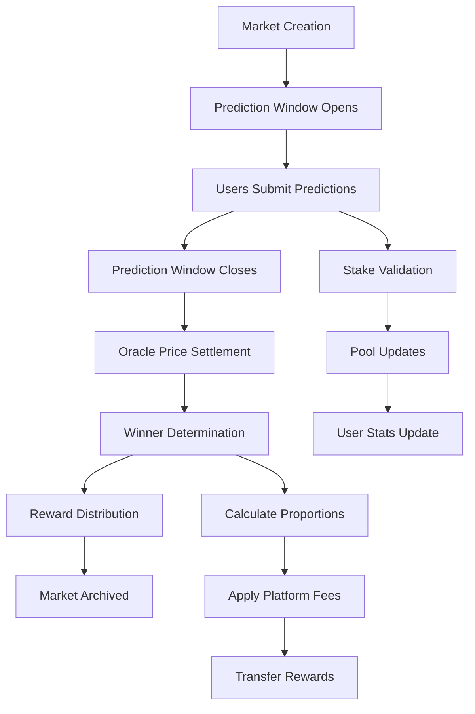

# StacksCast Protocol

## Advanced Bitcoin Price Prediction Market on Stacks Layer 2

[](https://stacks.co)
[](https://bitcoin.org)
[](https://clarity-lang.org)

## Overview

StacksCast is a sophisticated decentralized prediction market protocol built on Stacks Layer 2, enabling trustless Bitcoin price forecasting with automated settlements and proportional reward distribution. By leveraging Bitcoin's security through Stacks, the protocol creates a transparent, fair, and profitable DeFi ecosystem for price prediction markets.

### Key Features

- **🔒 Trustless Oracle Integration** - Precise price settlement with authorized oracle validation
- **💰 Proportional Rewards** - Fair distribution based on stake size and market participation
- **⚡ Dynamic Markets** - Flexible time windows and configurable parameters
- **🛡️ Anti-Manipulation** - Advanced security safeguards and minimum stake requirements
- **📊 Real-time Analytics** - Comprehensive user performance tracking
- **🎯 Bitcoin Native** - Full Stacks Layer 2 compatibility with Bitcoin security inheritance

## System Architecture

### High-Level Architecture

```
┌─────────────────────────────────────────────────────────────┐
│                    StacksCast Protocol                      │
├─────────────────────────────────────────────────────────────┤
│  Frontend Layer                                             │
│  ┌─────────────────┐  ┌─────────────────┐  ┌──────────────┐ │
│  │   Web Interface │  │  Mobile App     │  │  Admin Panel │ │
│  └─────────────────┘  └─────────────────┘  └──────────────┘ │
├─────────────────────────────────────────────────────────────┤
│  Smart Contract Layer (Stacks Layer 2)                     │
│  ┌─────────────────────────────────────────────────────────┐ │
│  │              StacksCast Contract                        │ │
│  │  ┌─────────────┐ ┌─────────────┐ ┌─────────────────────┐ │ │
│  │  │   Market    │ │  Prediction │ │     Reward          │ │ │
│  │  │ Management  │ │  Processing │ │   Distribution      │ │ │
│  │  └─────────────┘ └─────────────┘ └─────────────────────┘ │ │
│  └─────────────────────────────────────────────────────────┘ │
├─────────────────────────────────────────────────────────────┤
│  Oracle Layer                                               │
│  ┌─────────────────┐  ┌─────────────────┐  ┌──────────────┐ │
│  │  Price Feeds    │  │  Data Validation│  │  Settlement  │ │
│  │   (External)    │  │     Layer       │  │   Trigger    │ │
│  └─────────────────┘  └─────────────────┘  └──────────────┘ │
├─────────────────────────────────────────────────────────────┤
│  Bitcoin Network (Security Layer)                          │
│  ┌─────────────────────────────────────────────────────────┐ │
│  │              Bitcoin Blockchain                         │ │
│  │         (Final Settlement & Security)                   │ │
│  └─────────────────────────────────────────────────────────┘ │
└─────────────────────────────────────────────────────────────┘
```

### Contract Architecture

The StacksCast protocol is organized into several key modules:

#### Core Components

1. **Market Management**
   - Market creation and lifecycle management
   - Time-bounded prediction windows
   - Oracle-driven resolution system

2. **Prediction Engine**
   - User stake processing
   - Direction-based predictions (up/down)
   - Real-time pool calculations

3. **Reward Distribution**
   - Proportional payout calculations
   - Platform fee collection
   - Anti-double-spending mechanisms

4. **Analytics & Statistics**
   - User performance tracking
   - Platform metrics
   - Market status monitoring

## System Overview

### Market Lifecycle



### Data Flow Architecture

```
┌─────────────────┐    ┌─────────────────┐    ┌─────────────────┐
│   User Actions  │    │ Smart Contract  │    │ Oracle System   │
│                 │    │                 │    │                 │
│ • Create Market │───▶│ Market Storage  │    │ • Price Feeds   │
│ • Make Predict. │───▶│ Validation      │    │ • Settlement    │
│ • Claim Rewards │───▶│ Calculations    │◀───│ • Data Valid.   │
│ • View Stats    │───▶│ Distribution    │    │                 │
└─────────────────┘    └─────────────────┘    └─────────────────┘
         │                       │                       │
         │              ┌─────────────────┐              │
         └─────────────▶│ Stacks Network  │◀─────────────┘
                        │                 │
                        │ • Transaction   │
                        │   Processing    │
                        │ • State Updates │
                        │ • Event Logs    │
                        └─────────────────┘
                                 │
                        ┌─────────────────┐
                        │ Bitcoin Network │
                        │                 │
                        │ • Final         │
                        │   Settlement    │
                        │ • Security      │
                        │   Guarantees    │
                        └─────────────────┘
```

## Core Functions

### Public Functions

#### Market Management

- `create-market` - Initialize new prediction markets
- `resolve-market` - Oracle-driven market resolution
- `get-market-details` - Retrieve comprehensive market data
- `get-market-status` - Check market state and eligibility

#### User Participation

- `make-prediction` - Submit predictions with STX stakes
- `claim-winnings` - Claim proportional rewards from resolved markets
- `get-user-prediction-details` - View specific prediction data
- `calculate-potential-winnings` - Estimate potential payouts

#### Analytics & Statistics

- `get-platform-stats` - Platform-wide metrics and configuration
- `get-user-performance` - Comprehensive user performance data

#### Administrative Controls

- `update-oracle-address` - Modify authorized oracle
- `update-minimum-stake` - Adjust stake requirements
- `update-platform-fee` - Modify fee structure
- `withdraw-platform-fees` - Collect accumulated fees

## Data Structures

### Markets Map

```clarity
{
  start-price: uint,         // Bitcoin price at initialization
  end-price: uint,           // Bitcoin price at resolution
  total-up-stake: uint,      // Bullish prediction pool
  total-down-stake: uint,    // Bearish prediction pool
  start-block: uint,         // Prediction window start
  end-block: uint,           // Prediction window end
  resolution-block: uint,    // Market resolution timestamp
  resolved: bool,            // Resolution status
  creator: principal,        // Market creator address
}
```

### User Predictions Map

```clarity
{
  prediction-type: string,   // "up" or "down"
  stake-amount: uint,        // STX staked (microSTX)
  timestamp: uint,           // Submission block height
  claimed: bool,             // Reward claim status
  potential-payout: uint,    // Calculated winnings
}
```

### User Statistics Map

```clarity
{
  total-predictions: uint,   // Lifetime prediction count
  total-staked: uint,        // Cumulative STX staked
  total-won: uint,           // Total winnings claimed
  win-rate: uint,            // Win percentage (basis points)
}
```

## Security Features

### Anti-Manipulation Safeguards

- **Minimum Stake Requirements** - Prevents spam and manipulation
- **Maximum Stake Limits** - Protects against whale dominance
- **Time-bounded Markets** - Reduces long-term manipulation risks
- **Oracle Authorization** - Only authorized oracles can resolve markets

### Access Controls

- **Owner-only Functions** - Critical administrative functions restricted
- **Prediction Validation** - Comprehensive input validation
- **Double-spending Prevention** - Claims can only be made once
- **Balance Verification** - Ensures sufficient funds before operations

## Economic Model

### Fee Structure

- **Platform Fee**: 2.5% (250 basis points) - configurable by admin
- **Maximum Fee Cap**: 10% - hardcoded safety limit
- **Fee Distribution**: Collected fees go to contract owner

### Reward Calculation

```
Gross Winnings = (User Stake × Total Pool) ÷ Winning Pool
Platform Fee = Gross Winnings × Platform Fee Rate
Net Payout = Gross Winnings - Platform Fee
```

## Getting Started

### Prerequisites

- Stacks wallet (Hiro Wallet, Xverse, etc.)
- STX tokens for staking
- Understanding of prediction markets

### Basic Usage Flow

1. **Connect Wallet** - Connect your Stacks wallet to the platform
2. **Browse Markets** - View active prediction markets
3. **Make Predictions** - Stake STX on Bitcoin price direction
4. **Monitor Performance** - Track your predictions and analytics
5. **Claim Rewards** - Collect winnings from successful predictions

### Integration

```javascript
// Example integration with Stacks.js
import { StacksMainnet } from '@stacks/network';
import { callReadOnlyFunction, makeContractCall } from '@stacks/transactions';

// Get market details
const marketDetails = await callReadOnlyFunction({
  contractAddress: 'SP1234567890ABCDEF',
  contractName: 'stackscast-protocol',
  functionName: 'get-market-details',
  functionArgs: [uintCV(marketId)],
  network: new StacksMainnet(),
});

// Make a prediction
const txOptions = {
  contractAddress: 'SP1234567890ABCDEF',
  contractName: 'stackscast-protocol',
  functionName: 'make-prediction',
  functionArgs: [
    uintCV(marketId),
    stringAsciiCV('up'),
    uintCV(1000000) // 1 STX
  ],
  senderKey: privateKey,
  network: new StacksMainnet(),
};
```

## Configuration

### Platform Constants

- **Minimum Market Duration**: 10 blocks
- **Maximum Fee Percentage**: 10%
- **Maximum Stake Limit**: 100 STX

## Monitoring & Analytics

### Key Metrics

- **Total Markets Created**: Number of prediction markets
- **Total Volume**: Cumulative STX staked across all markets
- **Active Users**: Number of participants
- **Platform Revenue**: Accumulated fees
- **Win Rates**: User success percentages

### Events & Logging

The protocol emits events for:

- Market creation and resolution
- Prediction submissions
- Reward claims
- Administrative changes

## Roadmap

### Phase 1 (Current)

- ✅ Core prediction market functionality
- ✅ Oracle integration
- ✅ Proportional reward distribution
- ✅ User analytics

### Phase 2

- 🔄 Multi-asset prediction markets
- 🔄 Advanced analytics dashboard
- 🔄 Mobile application
- 🔄 Governance token integration

### Phase 3

- 📋 Cross-chain compatibility
- 📋 Automated market making
- 📋 Social prediction features
- 📋 Institutional API

## Contributing

We welcome contributions from the community! Please see our [Contributing Guidelines](CONTRIBUTING.md) for details on:

- Code style and standards
- Pull request process
- Issue reporting
- Community guidelines

## Security

### Audit Status

- **Internal Security Review**: ✅ Completed
- **External Audit**: 📋 Planned
- **Bug Bounty Program**: 📋 Launching
